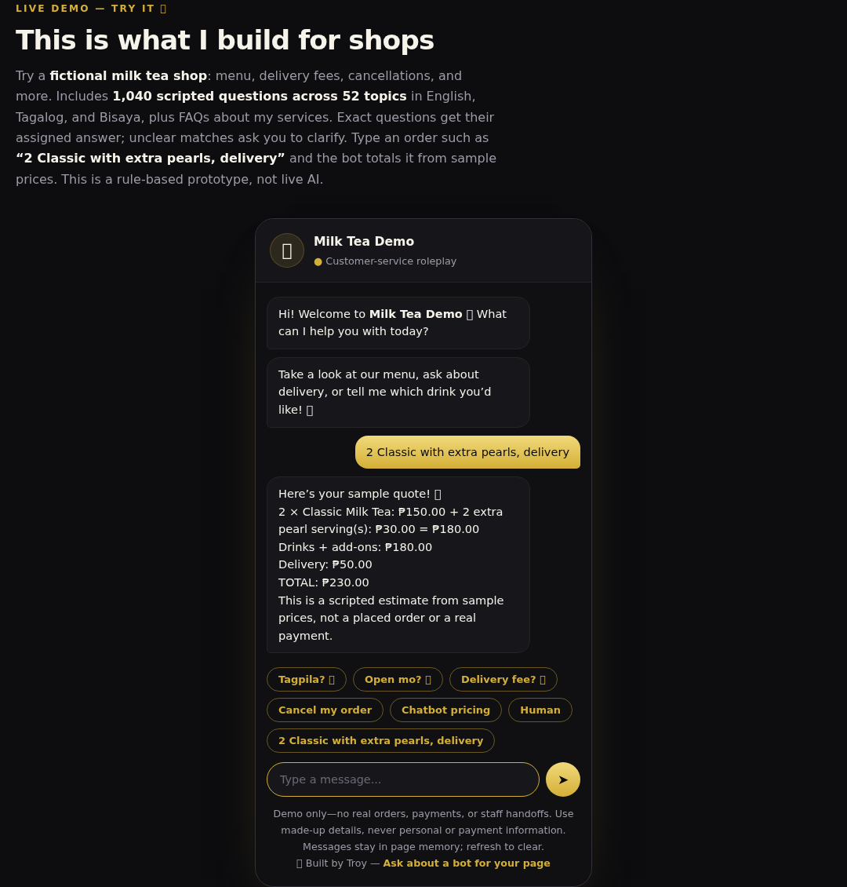

# Troy.Builds

Chatbots, automations, and video editing for PH businesses.

[Live website](https://techtroyai.github.io/Automation/) · [Chatbot guide](CHATBOT.md) · [Setup guide](TUTORIAL.md)

Preview the milk tea chatbot

- **1,040 scripted questions** in English, Tagalog, and Bisaya.
- **Chat pricing** — type an order and get a sample total with add-ons and delivery.
- **No build step** — plain HTML, CSS, and JavaScript.
- **Responsive** — one clean layout for desktop and Android/mobile web.

*Fictional shop demo. No real orders or payments.*

## Run locally

Open `index.html` with the `assets/` folder alongside it. No install required.

[Launch checklist](LAUNCH-CHECKLIST.md) · [MIT License](LICENSE)
